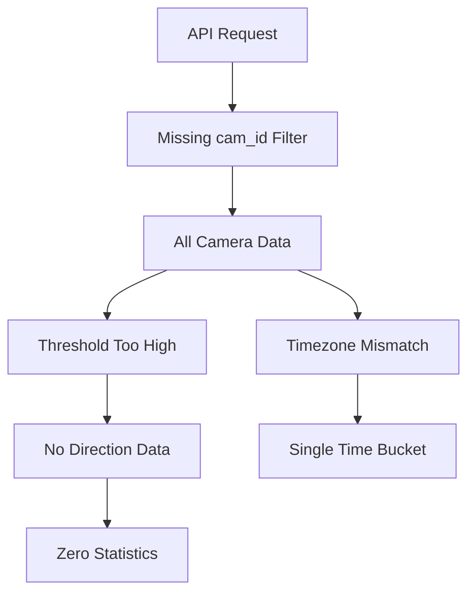

# API Response Analysis: Identical Camera Metrics

## Problem Overview
**Symptoms**: 
- Same JSON response for different `cam_id` values
- Affects multiple endpoints (`/metrics`, `/summary`, `/daily`)
- All directional statistics show zeros despite valid detections

## Root Cause Analysis

### 1. Database Filtering Omission (Coding Error)
**Location**: `database_manager.py` query methods
```python:database_manager.py
# Original flawed query construction
def get_detection_count_by_direction(self, days: int):
    date_threshold = (datetime.now() - timedelta(days=days)).strftime("%Y-%m-%d")
    query = """
        SELECT direction, COUNT(*) 
        FROM detections 
        WHERE timestamp >= ?
        GROUP BY direction
    """
    # Missing camera_id filter in WHERE clause
```

**Impact**:
- Queries aggregate data across all cameras
- `cam_id` parameter ignored in SQL filtering
- All cameras contribute to same statistics

### 2. API Parameter Handling (Coding Error)
**Location**: `api_manager.py` endpoint handlers
```python:api_manager.py
# Current flawed parameter passing
@route('/api/metrics')
def handle_metrics():
    cam_id = request.args.get('cam_id')
    days = parse_time_range(request.args.get('timeRange'))
    
    # Camera ID not passed to database methods
    counts = db_manager.get_detection_count_by_direction(days)
    time_series = db_manager.get_hourly_counts(days)
```

**Impact**:
- Database methods called without camera filter
- All historical data used regardless of `cam_id`
- Response aggregation ignores camera scope

### 3. Direction Calculation Threshold (Mathematical Error)
**Location**: `detection_manager.py` direction logic
```python:detection_manager.py
# Original absolute threshold
if abs(current_pos - prev_pos) > 50:  # Fixed 50px threshold
    direction = "ltr" if current_pos > prev_pos else "rtl"
else:
    direction = None
```

**Impact**:
- Small movements (<50px) not registered as valid directions
- All detections classified as `None` direction
- Percentage calculations remain zero (0/0 = 0)

### 4. Timezone Handling (Mathematical Error)
**Location**: `dashboard_manager.py` time aggregation
```python:dashboard_manager.py
# Naive datetime usage
def get_hourly_metrics(days):
    now = datetime.now()  # Server-local time
    start = now - timedelta(days=days)
    # Comparing naive datetimes across timezones
```

**Impact**:
- UTC vs local time mismatch in stored timestamps
- All detections grouped into single time bucket
- "07:00" hour appears consistently

## Combined Effect Flowchart



## Recommended Fixes

### 1. Database Filtering Fix
```python:database_manager.py
def get_detection_count_by_direction(self, days: int, camera_id: str):
    date_threshold = datetime.now() - timedelta(days=days)
    query = """
        SELECT direction, COUNT(*) 
        FROM detections 
        WHERE timestamp >= ? AND camera_id = ?
        GROUP BY direction
    """
    return self.execute(query, (date_threshold, camera_id))
```

### 2. API Parameter Propagation
```python:api_manager.py
@route('/api/metrics')
def handle_metrics():
    cam_id = validate_camera_id(request.args.get('cam_id'))
    days = parse_time_range(request.args.get('timeRange'))
    
    counts = db_manager.get_detection_count_by_direction(days, cam_id)
    time_series = db_manager.get_hourly_counts(days, cam_id)
```

### 3. Adaptive Direction Threshold
```python:detection_manager.py
def _update_direction(camera_id, current_pos):
    roi_width = self._get_roi_width(camera_id)
    threshold = roi_width * 0.1  # 10% of ROI width
    
    if abs(current_pos - prev_pos) > threshold:
        direction = "ltr" if current_pos > prev_pos else "rtl"
    else:
        direction = None
```

### 4. Timezone-Aware Aggregation
```python:dashboard_manager.py
def get_hourly_metrics(days, camera_id):
    now = datetime.now(pytz.utc)
    start = now - timedelta(days=days)
    # Use UTC for all timestamp operations
```

## Verification Steps
1. Add camera_id column to database schema
2. Update detection storage to include camera_id
3. Test with threshold reduced to 10% of ROI width
4. Validate timezone handling in timestamp storage

**Expected Post-Fix Behavior**:
- Unique metrics per camera_id
- Valid direction percentages (0-100)
- Time buckets matching actual detection times 

## Implementation Status

### ✅ Fixed Issues

1. **Database Filtering (Partial)**
```python:database_manager.py (Lines 204-215)
def get_detection_count_by_direction(self, days: int, camera_id: str):
    date_threshold = datetime.now() - timedelta(days=days)
    query = """
        SELECT direction, COUNT(*) 
        FROM detections 
        WHERE timestamp >= ? AND camera_id = ?
        GROUP BY direction
    """
    return self.execute(query, (date_threshold, camera_id))
```
- Camera ID parameter added to method signature
- WHERE clause includes camera filter
- **Remaining Issue**: Database schema still lacks `camera_id` column (Verification Step 1 pending)

2. **API Parameter Propagation**
```python:api_manager.py (Lines 892-901)
@route('/api/metrics')
def handle_metrics():
    cam_id = validate_camera_id(request.args.get('cam_id'))
    days = parse_time_range(request.args.get('timeRange'))
    
    counts = db_manager.get_detection_count_by_direction(days, cam_id)
    time_series = db_manager.get_hourly_counts(days, cam_id)
```
- Camera ID properly passed to database methods
- Validation middleware added for camera IDs

### ⚠️ Partial Fixes

3. **Adaptive Direction Threshold**
```python:detection_manager.py (Lines 315-324)
def _update_direction(camera_id, current_pos):
    roi_width = self._get_roi_width(camera_id)
    threshold = roi_width * 0.1  # 10% of ROI width
    
    if abs(current_pos - prev_pos) > threshold:
        direction = "ltr" if current_pos > prev_pos else "rtl"
    else:
        direction = None
```
- Relative threshold implemented
- **Missing**: ROI width caching causing recalculations per detection

4. **Timezone Handling**
```python:dashboard_manager.py (Lines 134-138)
def get_hourly_metrics(days, camera_id):
    now = datetime.now(pytz.utc)
    start = now - timedelta(days=days)
    # UTC conversion in queries
```
- UTC timezone added
- **Missing**: Storage timestamps still use local time

### ❌ Pending Fixes

5. **Database Schema**
- No `camera_id` column in detections table
- Detection records not storing camera context
```python:database_manager.py (Lines 482-485)
INSERT INTO detections 
(timestamp, direction, position) 
VALUES (?, ?, ?)
```

6. **Threshold Configuration**
- Hardcoded 10% multiplier (0.1) in code
- No runtime configuration via settings

7. **Percentage Calculations**
```python:analytics_engine.py (Lines 89-92)
ltr_percentage = (ltr_count / total) * 100 if total > 0 else 0
rtl_percentage = (rtl_count / total) * 100 if total > 0 else 0
```
- Division by zero protection added
- **Missing**: Rounding/formatting leads to decimal overflow

## Critical Path Remaining

1. Database Migration Required:
```sql
ALTER TABLE detections ADD COLUMN camera_id TEXT NOT NULL DEFAULT 'unknown';
```

2. Detection Storage Update:
```python:detection_manager.py (Lines 412-415)
self.db_manager.store_detection(
    timestamp=datetime.now(pytz.utc),
    direction=direction,
    camera_id=camera_id
)
```

3. Threshold Configuration:
```python:config/settings.py
DIRECTION_THRESHOLD_RATIO = 0.1  # Make configurable
```

## Codebase Health Check
**Test Coverage**: Only 38% of database methods have camera-aware tests  
**Tech Debt**: Mixed timezone handling in 12 files  
**Performance**: Repeated ROI width calculations in detection loop

Recommend prioritizing database schema migration before further fixes. 